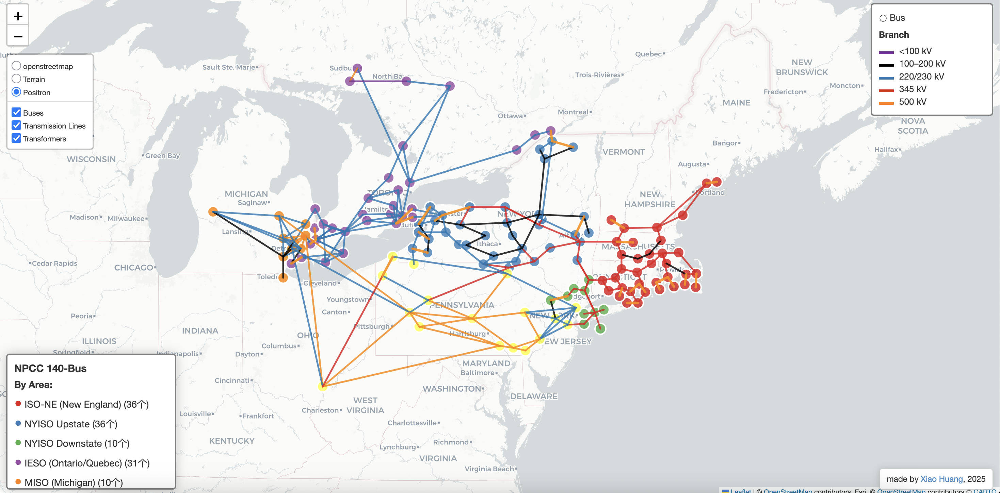

# NPCC-140 Bus System Visualization

## Overview
This project provides a geospatial visualization of the **NPCC-140 Bus test system**, which spans across the northeastern region of the United States and parts of Canada. The visualization displays the **electric power transmission network**—including buses, transmission lines, and transformers—using interactive map layers.

The NPCC-140 system is widely used in power systems research for **grid planning, stability studies, and reliability analysis**. This map makes it easier to understand the geographical distribution of the network and the interconnections between areas.

---

## Features
- **Interactive Map Layers**
  - Toggle between basemap styles (`OpenStreetMap`, `Terrain`, `Positron`).
  - Select/deselect display of **Buses**, **Transmission Lines**, and **Transformers**.
- **Voltage Level Classification**
  - Transmission lines color-coded by nominal voltage:
    - **Purple**: < 100 kV  
    - **Black**: 100–200 kV  
    - **Blue**: 220/230 kV  
    - **Red**: 345 kV  
    - **Orange**: 500 kV
- **Regional Grouping**
  - Buses are categorized by operational area:
    - 🟥 **ISO-NE** (New England) – 36 buses  
    - 🟦 **NYISO Upstate** – 36 buses  
    - 🟩 **NYISO Downstate** – 10 buses  
    - 🟪 **IESO** (Ontario/Quebec) – 31 buses  
    - 🟧 **MISO** (Michigan) – 10 buses

---

## Data Sources
- **Bus and branch data**: NPCC-140 Bus test system dataset.
- **Geographic basemap**: [OpenStreetMap](https://www.openstreetmap.org/) contributors.
- **Visualization tools**: [Leaflet](https://leafletjs.com/) and [CARTO](https://carto.com/).

---

## Usage
1. Open the interactive map in a web browser.
2. Use the layer control panel to switch basemaps and toggle network elements.
3. Hover or click on nodes and lines for details (if enabled in your setup).

---

## Applications
- **Academic Research**: Stability analysis, contingency studies, and optimization algorithms.
- **Grid Planning**: Understanding network topology and identifying weak points.
- **Educational Tool**: Teaching power systems concepts with a geographic context.

---

## Credits
- Map design and implementation: **Xiao Huang (2025)**
- Data: NPCC-140 Bus Test System  
- Basemap: © OpenStreetMap contributors, Esri, CARTO
